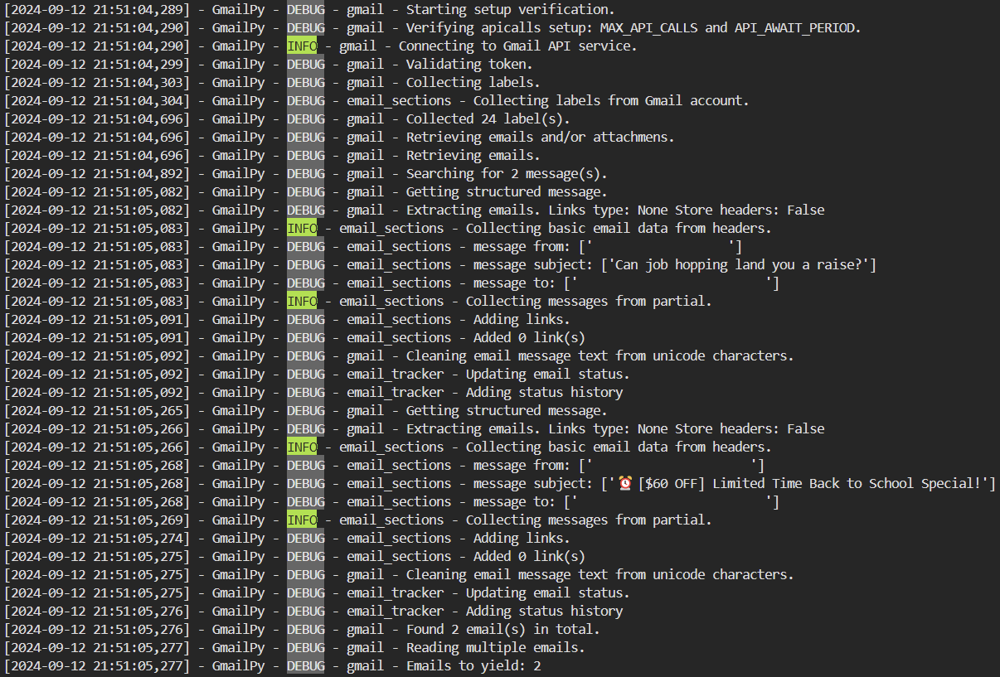

# Library details
-   Title: GmailPy - GmailPy: A Python Wrapper for Private Gmail Mailbox Access
-   Author: Gabriel Rodewald
-   GitHub: https://github.com/pyautoml/GmailPy
-   Version: 0.1.0
-   Created at: 10.09.2024 
-   License: MIT
-   Dependencies: Libraries listed in attached requirements.txt file

# **Overview**
GmailPy is a Python library designed to simplify the process of accessing and managing emails from a private Gmail mailbox. It leverages the Google API to provide a robust and secure interface for developers to interact with Gmail data.

<b><span style="color: red;">[IMPORTANT]</span></b> Remember to add this entry to .gitignore (if not added).
```bash
/credentials
```

Project's structure:
```bash
GmailPy
├── src
│  ├── compiled_regexes.py
│  ├── email_enumerators.py
│  ├── email_sections.py
│  ├── email_tracker.py
│  ├── exceptions.py
│  ├── gmail.py
│  ├── palyground.py                    # go there to check how it works
│  ├── README.md                        # you are here
│  ├── requirements.txt
│  ├── template.py
│  ├── utils.py
│  └── __init__.py
├── credentials
│  ├──                                  # add here: conf.conf
│  └──                                  # add here: general.json
├── tests                               # will be provided soon
│  ├── test_compiled_regexes.py
│  ├── test_email_enumerators.py
│  ├── test_email_sections.py
│  ├── test_email_tracker.py
│  ├── test_exceptions.py
│  ├── test_gmail.py
│  ├── test_utils.py
│  ├── test_template.py
│  └── __init__.py
├── .gitignore                          # make sure to add here: /credentials
└── requirements.txt

```

# **Key Features**

1. **Authentication**: GmailPy supports OAuth 2.0 authentication, allowing users to securely access their private Gmail accounts without sharing their login credentials.

2. **Email Retrieval**: The library enables users to retrieve emails based on various criteria, such as sender, recipient, subject, and date range. It supports pagination to handle large result sets efficiently.

3. **Email Parsing**: GmailPy provides a simple interface for parsing email content, including extracting text, HTML, and attachments. It utilizes the BeautifulSoup library to parse HTML content and extract relevant information.

4. **Email Filtering**: Users can filter emails based on custom criteria, such as removing spam, unread emails, or emails containing specific keywords.

5. **Email Labeling and Tagging**: GmailPy allows users to label and tag emails, making it easier to organize and manage their inbox.

6. **Email Sending**: The library supports sending emails with attachments, including text, HTML, and images.

7. **Error Handling**: GmailPy provides robust error handling to handle various scenarios, such as network errors, authentication failures, and API rate limits.

# **Technical Details**

GmailPy is built using Python and is designed to be easy to integrate into existing projects. It utilizes the Google API Client Library for Python to interact with the Gmail API. The library follows best practices for error handling, authentication, and resource management.

The source code is organized into a modular structure, with each component responsible for a specific functionality. The library provides clear and concise documentation, including code examples and usage instructions.


<b><span style="color: red;">[IMPORTANT]</span></b> You need to have an active private Gmail account to utilize this library. Read more in `Usage` section below.


## **Installation**

### From Wheel
After downloading the wheel package, run:
```python
cd path/to/gmail/dist
pip install GmailPy-0.1.0-py3-none-any.whl
```

### From Source Directory

Unpack the file locally and run:
```python
cd path/to/gmail_service/src
pip install -e .
```

## **Usage**
### Scopes <b><span style="color: red;">[IMPORTANT]</span></b>
-   To use all Gmail API mailbox features you need to grant all privileges (this is full name of that scope ->) `https://mail.google.com/`
- If you don't need to delete emails from your mailbox, you should be fine with **readonly** and **send** scopes:
    -   `https://www.googleapis.com/auth/gmail.send` to send emails
    -   `https://www.googleapis.com/auth/gmail.readonly` to read email

Please read about application scopes before going further: https://developers.google.com/gmail/api/auth/scopes


### Application setup
To use GmailPy, you need to follow these steps:

1. Create a new project in the Google Cloud Console and enable the Gmail API: https://console.cloud.google.com/welcome

2. Go to Dashboard and configure project's settings: https://console.cloud.google.com/apis/dashboard
    - Enable Gmail API interface: https://console.cloud.google.com/apis/library
    - Create OAuth 2.0 Client Identificator (click 'Credentials' on the left panel, it should redirect you to url like `console.cloud.google.com/apis/credentials?project=your-project-id`)
    You need to copy 2 fields and add them to your config file:
        - Client Id (top right on the panel)
        - Client Secret (key) (below Client Id)
    - OAuth Consent Screen (url should look like `https://console.cloud.google.com/apis/credentials/consent/edit?project=your-project-id`): fill in missing data at each of the steps:
        -   OAuth consent screen
        -   Scopes: in the ` Your restricted scopes` section provide scopes for the application.

    
        
        -   Test users
        -   Summary


3. Set up your Python environment by installing the required dependencies. I'ts advised to use virtual environment for testing purposes.

```python
# pip install -r requirements.txt
pip install gmailpy
```

4. Import the GmailPy library and initialize the client.

Obligatory aprameters:
- setup (dict)

You can replace this part by delivering credentials in more customized way.
```python
from GmailPy import GmailClient

# config example, you can store the details in json file as well
config = ConfigParser()
config.read("./conf.conf")


gmail = GmailService(
        # setup parameter is obligatory
        setup={
            # token.pickle will be generated automatically
            "token_file": abspath(f"{config.get('GMAIL','path')}/token.pickle"),
            # you need to provide all necessary credentails in json file
            "credentias_file": abspath(f"{config.get('GMAIL','path')}/general.json"),
            # providing scope(s) is a must for the app to run
            "scopes": ' '.join(config.get('GMAIL','scopes').split(",")),
            # if you stated any protected labels in conf.conf, it will be parsed here
            "protected_labels": config.get('GMAIL_LABELS','protected')
        },
        warnings_on = True,         # optional: True/False (True by default)
        max_api_calls = None,       # optional: None or any positive int value (3 by default)
        api_await_period = None     # optional: None or any positive int value (in seconds, 10 by default)
    )
```

How the files content should look like:

**conf.conf** content:
```bash
# how a conf.conf file looks like:
[GMAIL]
path=path_to_json_credentials_file/
scopes=your_scopes
api_key=you_api_key
app_token=your_app_token

# optional, if you want to prevent deleting specified email labels
[GMAIL_LABELS]
protected_labels=INBOX,MyCustomLabel_1,MyCustomLabel_2, ...
```

**general.json** file content:
Redirect uris should be the same as you set in the Gmail API app console.
If you use this library only on your local environment, stating localhost should be fine.

```json
{
    "installed":
    {
        "client_id": "your_client_id",
        "project_id":"your_project_id",
        "auth_uri":"https://accounts.google.com/o/oauth2/auth",
        "token_uri":"https://oauth2.googleapis.com/token",
        "auth_provider_x509_cert_url":"https://www.googleapis.com/oauth2/v1/certs",
        "client_secret":"your_client_secret",
        "redirect_uris":["http://localhost","https://localhost"]
    }
}
```

5. Use the client to interact with the Gmail API, such as retrieving emails, sending emails, or managing labels:

```python
# Manage labels
gmail._create_label(label_name)
gmail._delete_label(label_name)

# Retrieve emails
email = gmail._get_emails(max_resulst=1, links_type=LinksType.BASIC, raw=False)

# Read emails
gmail._read_email(email[0])

# Create Draft messages
gmail._create_email_draft(draft_message=text, subject="Weekly Emails Summary")

# Create emails
email = gmail._create_email(
        sender=your_email,
        recipient=your_email,
        subject="Hello from PyLlama!",
        email_message="Hello,\nThis is a test email.",
    )

# Send an email
gmail._send_email(email=email)

# Delete email
gmail._delete_email(email)

# Empty Trash
gmail._empty_trash()
```

## Logging
This library supports console logging.

It's easily customizable and can be provided in 3 different ways:
- no logger,
- library inbuilt logger,
- your custom logger.

```python
# No logging
gmail = GmailService(setup=setup())

# Default logging
gmail = GmailService(setup=setup(), log_level="info")

# Your custom logger
gmail = GmailService(setup=setup(), logger=YourLogger)
```


All standard log levels are supported:
```python
logging.DEBUG
logging.INFO
logging.WARNING
logging.ERROR
logging.CRITICAL
logging.EXCEPTION
```

**Console examples:**
```bash
[2024-09-12 22:30:25,297] - GmailPy - DEBUG - gmail - Starting setup verification.
[2024-09-12 22:30:25,297] - GmailPy - DEBUG - gmail - Verifying apicalls setup: MAX_API_CALLS and API_AWAIT_PERIOD.
[2024-09-12 22:30:25,297] - GmailPy - INFO - gmail - Connecting to Gmail API service.
[2024-09-12 22:30:25,297] - GmailPy - DEBUG - gmail - Validating token.
[2024-09-12 22:30:25,301] - GmailPy - DEBUG - gmail - Collecting labels.
[2024-09-12 22:30:25,301] - GmailPy - DEBUG - email_sections - Collecting labels from Gmail account.
[2024-09-12 22:30:25,767] - GmailPy - DEBUG - gmail - Collected 24 label(s).
```

**Logs have colored labels based on their log level:**

The Logger efficiently identifies the file source of the module responsible for distributing messages.


Reading many emails (DEBUG):



## Asynchronous requests
This library doesn't provide async calls. It is planned to add such functionality in the next release.

## Custom search filters

```python
filters = {
    "criteria": {
        "from": "example@example.com",            # Filter by sender
        "subject": "Important Update",            # Filter by subject
        "query": "urgent OR action required",     # Filter by keywords in the body
        "hasAttachment": True,                    # Filter messages that have attachments
        "size": "5000000",                        # Filter messages larger than 5MB
        "before": "2023/01/01",                   # Filter messages received before January 1, 2023
        "after": "2022/12/31",                    # Filter messages received after December 31, 2022
        "labelIds": ["INBOX"],                    # Filter by specific label
        "isRead": False                           # Filter for unread messages
    },
    "action": {
        "addLabelIds": ["IMPORTANT"],              # Add label to filtered messages
        "removeLabelIds": ["INBOX"]                # Remove from inbox
    }
}
```


# **Support**

If you encounter any issues or need assistance with GmailPy, please feel free to open an issue on the GitHub repository:

https://github.com/pyautoml/GmailPy/issues

We are committed to providing support and continuously improving the library. Feel welcome to report any bugs 🐛

# **License**

GmailPy is licensed under the MIT License. You can find the full license text in the project repository on GitHub:

https://github.com/pyautoml/GmailPy/License.md
